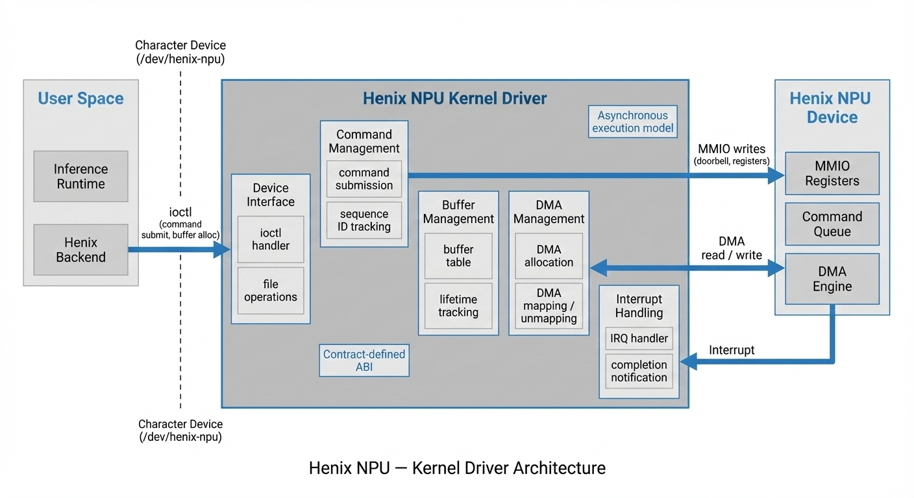

# Henix NPU — Full-Stack Accelerator Simulation Platform

**Henix** is a full-stack Neural Processing Unit (NPU) simulation project that models the complete software stack of a modern AI accelerator — from inference runtime to kernel driver to device execution.

The project provides a realistic environment for developing, validating, and evolving accelerator software **before hardware exists**, using a contract-driven architecture and real inference workloads.

---

## 🌐 Project Overview

Henix models the full lifecycle of accelerator execution:

> **Inference Runtime → Kernel Driver → Device Model → DMA → Compute**

The system is designed to reflect how production NPUs are programmed, managed, and integrated into AI frameworks, while remaining lightweight and extensible.

---

## 🧩 System Components

### Inference Runtime

* Integrates with an existing inference codebase ([llama2.c](https://github.com/karpathy/llama2.c))
* Provides a backend that maps high-level tensor operations to NPU commands
* Designed to support typical tensor operators (Currently only MATMUL supported).

---

### Kernel Driver

* Exposes a device-style interface to user space
* Manages buffer allocation and lifetime
* Implements command submission and completion tracking
* Acts as the isolation and resource-management layer

---

### Device Model (QEMU)

* Implements a memory-mapped NPU device
* Executes commands issued by the driver
* Performs DMA reads and writes
* Models asynchronous execution and interrupt delivery

---

### Contract (Shared ABI)

* Defines command formats, opcodes, and register layout
* Shared by inference runtime, kernel driver, and device model
* Serves as the **single source of truth** for all components
* Enables independent evolution of each domain

---

## 🧠 Architectural Principles

### Full-Stack Ownership

Henix treats the accelerator as a system, not a library.
Each layer is explicit, isolated, and independently testable.

---

### Contract-Driven Design

All interactions are governed by a stable contract rather than implicit assumptions, enabling:

* Clear domain boundaries
* Reproducible behavior
* Hardware-like ABI discipline

---

### Emulator-First Development

By modeling the NPU in QEMU, Henix enables:

* Early software development
* Deterministic debugging
* Hardware-independent iteration
* Seamless transition to real silicon

---

## 🚀 Functional Scope

Henix is designed to support a broad set of accelerator operations, including:

* Dense linear algebra (e.g. MATMUL)
* Element-wise tensor operations
* Data movement and synchronization
* Multi-operator execution graphs
* Future extensions such as attention and normalization

The architecture intentionally does not constrain the system to a single operator.

---

## 📁 Repository Structure
TBD

---

## 📚 Documentation
TBD

---

## 🎯 Intended Use

Henix is intended for:

* Accelerator software development
* NPU architecture exploration
* Inference runtime integration studies
* Full-stack AI system experimentation

It is not tied to any specific hardware implementation.

---

## 📜 License

Open for research, experimentation, and educational use.
